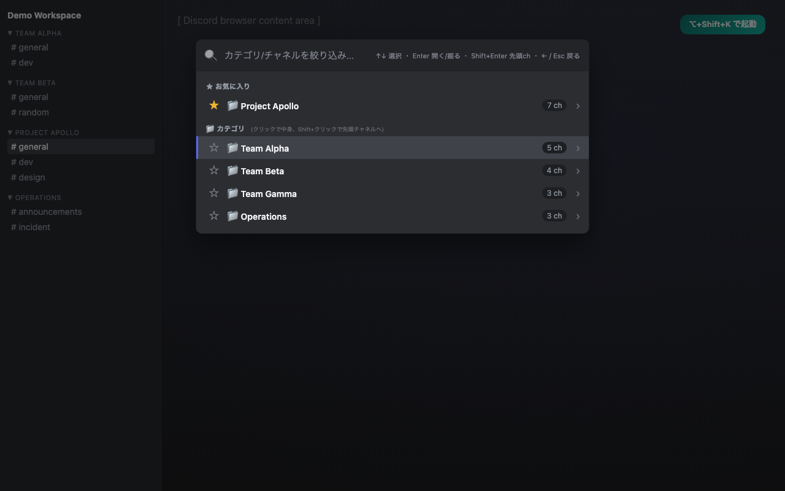
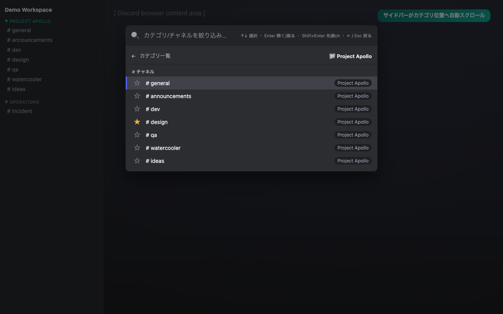

# Channel Quick Finder

> ⚠️ **非公式・無保証・自己責任**
>
> 本拡張機能は Discord Inc. による開発・承認・後援を一切受けていない
> **非公式の第三者製ツール**です。
>
> 本拡張機能を **インストールまたは使用することで、利用者は [利用規約 (TERMS.md)](./TERMS.md)
> および [プライバシーポリシー (PRIVACY.md)](./PRIVACY.md) に同意したものとみなされます。**
> 同意できない場合はインストールしないでください。
>
> 本拡張機能は「現状有姿 (AS IS)」で提供され、いかなる保証もありません。
> Discord の UI 仕様変更による動作不能、アクセス制限、アカウントへの影響、
> Discord Inc. または第三者からの請求等、いかなる事象についても作者は
> **一切の責任を負いません**。詳細は [TERMS.md](./TERMS.md) を参照。
>
> "Discord" は Discord Inc. の商標です。対応サービスを示すためにのみ言及しています。
>
> ---
>
> **Unofficial — use at your own risk.** By installing or using this extension
> you agree to the [Terms of Use](./TERMS.md) and [Privacy Policy](./PRIVACY.md).
> The extension is provided "AS IS" with no warranty. The author assumes no
> liability for any damages, account impact, or third-party claims arising from
> use of this extension. See [TERMS.md](./TERMS.md) for full legal terms.

Discord ブラウザ版 (`https://discord.com/channels/*`) で、ショートカット一発で
**カテゴリ/チャネルを検索 & ドリルダウン**できる Chrome 拡張機能。30チーム規模の業務サーバーで
「自分の入るチャネルを毎回探す」のがしんどい人向け。

## スクリーンショット

カテゴリ一覧 (デフォルト表示):



カテゴリをクリックするとドリルダウン + サイドバーがそのカテゴリ位置までスクロール:



> 上記は実際のオーバーレイCSSをそのまま使ったモック画像 (`docs/mock-{top,drill}.html`) です。

## できること

- **ショートカット起動**: `Option+Shift+K` (Mac) / `Alt+Shift+K` (Win) でオーバーレイを開く
- **カテゴリ主体**: デフォルト表示は **カテゴリ一覧**
- **ドリルダウン**: カテゴリをクリックすると中身のチャネル一覧に潜る (同時に Discord サイドバーがそのカテゴリ位置までスクロール)
- **ショートカット動作**:
  - `Enter` / クリック → カテゴリは潜る、チャネルは遷移
  - `Shift+Enter` / `Shift+クリック` → カテゴリの先頭チャネルに直接ジャンプ
  - `←` / `Esc` / 戻るボタン → ドリルダウンから戻る、トップでは閉じる
- **絞り込み検索**: 入力するとカテゴリ + チャネル両方ヒット (ドリルダウン中はそのカテゴリ内に限定)
- **お気に入り (★)**: カテゴリ/チャネルどちらでもピン留め可 (サーバーごと保存)

## 動作の透明性

- ❌ Discord の API を一切呼ばない
- ❌ アカウントを自動操作しない (メッセージ送信などはしない)
- ✅ 画面に描画された DOM のみを参照
- ✅ お気に入りは `chrome.storage.sync` (Google同期) にのみ保存。外部送信ゼロ
- ✅ アナリティクス / トラッキング一切なし

詳細は [PRIVACY.md](./PRIVACY.md) を参照。

## インストール (開発者モード)

1. Chrome で `chrome://extensions` を開く
2. 右上の「**デベロッパーモード**」を ON
3. 「**パッケージ化されていない拡張機能を読み込む**」をクリック
4. このリポジトリのルートフォルダを選択
5. `https://discord.com/channels/...` を開いて `Option+Shift+K` を押すと検索オーバーレイが出ます

## ショートカットの変更

`chrome://extensions/shortcuts` から自由に変更できます。

## 開発

```bash
npm install                  # devDependencies (jsdom + sharp)
npm test                     # DOM スキャンの jsdom テスト
node scripts/build-icons.js  # アイコン (SVG → 4サイズPNG) を再生成
```

## 制約・既知の挙動

- Discord は左サイドバーを仮想スクロールで描画するため、オーバーレイを開くタイミングで一度サイドバーをスキャンします (一瞬スクロールが動きます)
- Discord 側の UI 大幅変更でセレクタが壊れる可能性あり。その場合は `src/content.js` の `collectVisibleChannels` / `extractNameFromItem` / `findChannelListRoot` を調整してください

## ファイル構成

```
.
├── manifest.json
├── src/
│   ├── background.js     # ショートカット受信 → content への中継 (Service Worker)
│   ├── content.js        # DOM スキャン + オーバーレイUI + お気に入り永続化
│   └── overlay.css       # オーバーレイのスタイル
├── icons/                # 拡張機能アイコン (16/32/48/128 PNG + SVG原本)
├── scripts/
│   └── build-icons.js    # アイコン生成スクリプト (sharp 使用)
├── test/
│   └── test-dom-scan.js  # jsdom ベースの DOM スキャン単体テスト
├── PRIVACY.md            # プライバシーポリシー
├── STORE_LISTING.md      # Chrome Web Store 提出用テキスト原稿
└── README.md
```

## リリース

Chrome Web Store に出す場合の手順は [STORE_LISTING.md](./STORE_LISTING.md) に提出原稿あり。

## ライセンス

MIT
